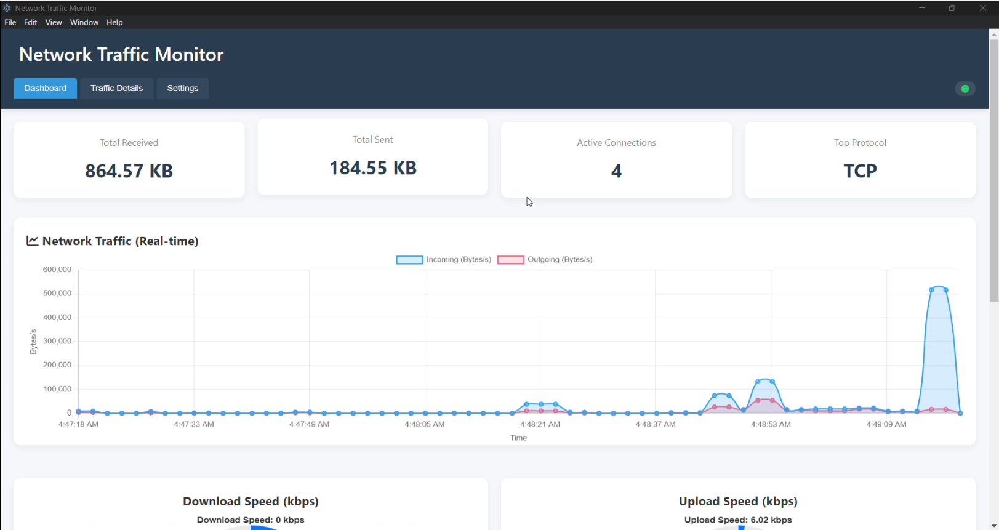

# Network Traffic Monitor

A real-time network traffic monitoring application with intrusion detection capabilities. This tool provides visualization of network traffic, protocol distribution analysis, and machine learning-based threat detection.



## Features

- Real-time network traffic visualization
- Protocol distribution analysis
- Top bandwidth usage by application/IP
- Traffic details table with filtering
- Speed monitoring (download/upload)
- Intrusion detection using machine learning
- Alert notifications for suspicious traffic

## Requirements

### System Requirements
- Windows 10/11 (64-bit) or Linux
- 4GB RAM minimum (8GB recommended)
- 500MB free disk space

### Software Requirements
- Python 3.8+ installed
- Node.js 14+ and npm
- Npcap installed (for Windows)
- Administrator privileges

### Python Packages
- Flask
- Scapy
- NumPy
- pandas
- joblib
- psutil

### JavaScript Packages
- Electron
- Chart.js

## Installation

### 1. Clone the repository
```bash
git clone https://github.com/Abhinashroy/NetworkTrafficMonitor.git
cd NetworkTrafficMonitor
```

### 2. Install Npcap (Windows only)
Download and install Npcap from [https://npcap.com/](https://npcap.com/)

### 3. Install Python dependencies
```bash
pip install flask scapy numpy pandas joblib psutil
```

### 4. Install frontend dependencies
```bash
cd frontend
npm install
```

## Running the Application

### 1. Start the backend server (with administrator privileges)
Open a command prompt as Administrator and run:

```bash
cd backend
python app2.py
```

### 2. Start the frontend application
In a new terminal window:

```bash
cd frontend
npm start
```

The application should automatically open in a new window.

## Project Structure

```
NetworkTrafficMonitor/
├── backend/
│   ├── app.py              # Legacy Flask server
│   ├── app2.py             # Current Flask server with ML integration
│   ├── traffic_analyzer.py # Network traffic analysis
│   ├── pack_sniffer.py     # Packet capture and processing
│   ├── utils.py            # Utility functions
│   └── ml_model/           # Machine learning models for threat detection
├── frontend/
│   ├── index.html          # Main UI
│   ├── style.css           # Styling
│   ├── renderer.js         # Charts and UI logic
│   ├── main.js             # Electron main process
│   └── package.json        # Node.js dependencies
└── README.md
```

## Troubleshooting

### Backend Issues
- Ensure you're running with administrator privileges.
- Verify Npcap is installed correctly.
- Check firewall settings if capturing packets fails.

### Frontend Issues
- If charts aren't displaying, check browser console for errors.
- Try clearing browser cache if UI elements are missing.

## License

This project is licensed under the MIT License.

## Acknowledgements

- Chart.js for visualization
- Scapy for packet manipulation
- Electron for desktop application framework
