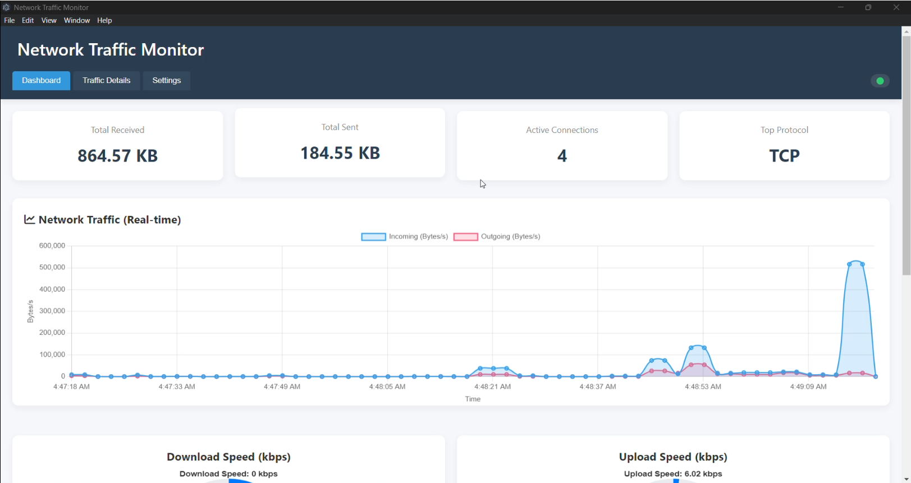

# Network Traffic Monitor 

[](https://opensource.org/licenses/MIT)
[](https://www.python.org/downloads/)
[](https://nodejs.org/)
[]()



> Enterprise-grade network monitoring solution with real-time analytics and machine learning-powered threat detection

## 🔍 Overview

The Network Traffic Monitor is a comprehensive solution for real-time network analysis, providing:
- Live traffic visualization and protocol breakdowns
- Bandwidth consumption monitoring by application/IP
- Machine learning-based intrusion detection system
- Alerting for suspicious network activities
- Cross-platform support (Windows, macOS, Linux)

## ✨ Key Features

| Feature | Description |
|---------|-------------|
| 🎨 Real-time Visualization | Interactive dashboards showing live network traffic |
| 📊 Protocol Analytics | Detailed breakdown by protocol (TCP/UDP/ICMP etc.) |
| 🔍 Traffic Filtering | Advanced filtering of captured packets |
| ⚡ Performance Metrics | Download/upload speed monitoring |
| 🤖 Threat Detection | ML-powered anomaly detection using Random Forest |
| 🚨 Alert System | Email notifications for suspicious activities |
| 💻 Cross-Platform | Runs on Windows, macOS, and Linux |

## 🛠️ Technical Stack

### Backend
- **Core**: Python 3.8+
- **Framework**: Flask + Flask-CORS
- **Networking**: Scapy (packet capture)
- **ML**: scikit-learn, joblib (pre-trained Random Forest model)
- **Utils**: psutil, pandas, NumPy, python-dotenv

### Frontend
- **Framework**: Electron.js
- **Visualization**: Chart.js
- **UI**: HTML5, CSS3, JavaScript

## 🚀 Installation Guide

## 📦 Self-Contained Installers (For End Users)

End users should **not** need to install Python packages manually.

- Use the installer built for your OS/architecture:
  - macOS: `.dmg`
  - Windows: `Setup .exe` or portable `.exe`
  - Linux: `.AppImage` or `.deb`
- The app package includes the backend folder and a backend virtual environment built on that same OS.
- When users click **Allow**, the app starts the bundled backend and grants consent. It does **not** run `pip install`.

### Build Correctly For Global Distribution

Do not rely on one machine to build all OS installers with a shared backend runtime.

- Build mac installers on macOS.
- Build Windows installers on Windows.
- Build Linux installers on Linux.

This repository includes:

- Local scripts in [frontend/package.json](frontend/package.json):
  - `npm run build-mac-self-contained`
  - `npm run build-win-self-contained`
  - `npm run build-linux-self-contained`
- GitHub Actions matrix workflow in [.github/workflows/build-installers.yml](.github/workflows/build-installers.yml) that builds each OS installer on its matching runner.

### Prerequisites

#### Windows
- **OS**: Windows 10/11 (64-bit)
- **Python**: 3.8 or higher ([Download](https://www.python.org/downloads/))
- **Node.js**: 14 or higher ([Download](https://nodejs.org/))
- **Admin Rights**: Required for packet capture
- **Npcap**: Required for packet sniffing on Windows
  - Download from: https://nmap.org/npcap/
  - Install with WinPcap API compatibility enabled

#### macOS
- **OS**: macOS 10.15 or higher
- **Python**: 3.8 or higher (via Homebrew or official installer)
- **Node.js**: 14 or higher
- **Xcode Command Line Tools**: `xcode-select --install`
- **libpcap**: Usually pre-installed, or install via Homebrew: `brew install libpcap`

#### Linux (Ubuntu/Debian)
- **OS**: Ubuntu 18.04+ or Debian 10+
- **Python**: 3.8 or higher
- **Node.js**: 14 or higher
- **libpcap**: `sudo apt-get install libpcap-dev`
- **Build tools**: `sudo apt-get install build-essential python3-dev`

### Installation Steps

#### 1. Clone or Download the Repository
```bash
cd NetworkTrafficMonitor
```

#### 2. Configure Environment Variables
```bash
# Copy the example environment file
cp .env.example .env

# Edit .env and add your settings (optional):
# - FLASK_PORT: Backend port (default: 5000)
# - Email settings for alerts
# - ML model settings
nano .env  # or use your preferred editor
```

#### 3. Run the Application

**Option A: Automated Startup (Recommended)**

##### macOS / Linux
```bash
chmod +x run_network_monitor.sh
./run_network_monitor.sh
```

The script will:
- Create Python virtual environment
- Install dependencies
- Start the backend server
- Start the Electron frontend
- Handle privilege escalation for packet capture

##### Windows
```bash
run_network_monitor.bat
```

The batch file will:
- Create Python virtual environment
- Install dependencies
- Start the backend with admin privileges
- Start the Electron frontend

**Option B: Manual Startup**

##### Backend (in terminal 1)
```bash
cd backend

# macOS / Linux
python3 -m venv venv
source venv/bin/activate  # On Windows: venv\Scripts\activate.bat
pip install -r requirements.txt

# Run with sudo on macOS/Linux for packet capture
sudo python3 app2.py  # macOS/Linux
python app2.py        # Windows (requires admin terminal)
```

##### Frontend (in terminal 2)
```bash
cd frontend
npm install
npm start
```

### Access the Application

Once started, the application will open automatically. If not:
- **Frontend**: Open your browser (if running separately) - configured for Electron
- **Backend API**: http://localhost:5000
- **API Health Check**: http://localhost:5000/api/health

## ⚙️ Configuration

### Email Alerts (Optional)

To enable email notifications for threat detection:

1. **Gmail Setup**:
   - Enable 2-Factor Authentication on your Gmail account
   - Generate an App Password: https://myaccount.google.com/apppasswords
   - Copy the 16-character password

2. **Environment Variables** (in `.env`):
   ```
   ALERT_EMAIL_SENDER=your_email@gmail.com
   ALERT_EMAIL_RECEIVER=recipient@example.com
   ALERT_EMAIL_PASSWORD=your_app_password
   ```

3. **Restart the backend** - alerts will now be sent when threats are detected

### ML Model Settings

Edit `.env` to adjust ML threat detection:
```
ML_MODEL_ENABLED=True          # Enable/disable ML detection
ML_ANOMALY_THRESHOLD=0.5       # Confidence threshold (0-1)
```

## 📱 API Endpoints

### Backend API

| Endpoint | Method | Description |
|----------|--------|-------------|
| `/api/data` | GET | Get current network traffic data (JSON) |
| `/api/health` | GET | Check if backend is running |

### Response Format

```json
{
  "total_incoming_bytes": 1024000,
  "total_outgoing_bytes": 512000,
  "speed": {
    "incoming_kbps": 128,
    "outgoing_kbps": 64
  },
  "protocol_distribution": {
    "TCP": 2048000,
    "UDP": 512000,
    "ICMP": 1024
  },
  "top_ips": {
    "192.168.1.1": {
      "hostname": "router.local",
      "app": "chrome",
      "incoming_bytes": 512000,
      "outgoing_bytes": 256000
    }
  },
  "traffic_table": [
    {
      "timestamp": "14:30:45",
      "src_ip": "192.168.1.100",
      "src_port": 54321,
      "dst_ip": "8.8.8.8",
      "dst_port": 443,
      "protocol": "TCP",
      "bytes": 1024
    }
  ]
}
```

## 🤖 ML Threat Detection

The application includes a pre-trained Random Forest model for detecting network anomalies:

- **Model**: Random Forest Classifier
- **Features**: Protocol, port numbers, packet counts, byte counts, flow duration
- **Training Data**: NSL-KDD dataset
- **Detection**: Real-time analysis of network flows

### How It Works

1. Packet sniffer captures network traffic
2. Features are extracted from network flows
3. ML model predicts normal vs. anomalous traffic
4. Alerts are triggered for suspicious activity

## 📊 Dashboard Features

- **Real-time Traffic Chart**: Incoming/Outgoing bytes per second
- **Protocol Distribution**: Pie chart of protocol usage
- **Top Connections**: List of most active IP addresses
- **Network Speedometer**: Download/Upload speeds
- **System Status**: Connection status and backend health
- **Traffic Details**: Packet-level information with filtering

## 🔒 Security Notes

### Packet Capture Privileges
- **Linux/macOS**: Requires root/sudo (for raw socket access)
- **Windows**: Requires Administrator privileges
- The launch scripts handle privilege escalation automatically

### CORS Configuration
- Frontend runs on Electron (file:// protocol)
- Backend allows requests from localhost:3000, localhost:5000
- All API endpoints are CORS-enabled

### Email Credentials
- Store in `.env` file only (not in code)
- Use App Passwords for Gmail, not your actual password
- `.env` is in `.gitignore` (not committed to git)

## 🐛 Troubleshooting

### Backend Won't Start
```bash
# Check Python version
python3 --version  # Should be 3.8+

# Check if port 5000 is available
# Linux/macOS:
lsof -i :5000

# Windows:
netstat -ano | findstr :5000

# Kill process using port 5000 and restart
```

### Packet Capture Not Working
```bash
# macOS: Check if sudo is working
sudo -v

# Linux: Verify libpcap is installed
sudo apt-get install libpcap-dev

# Windows: Verify Npcap is installed with WinPcap compatibility
```

### Frontend Won't Load
```bash
# Check if npm dependencies are installed
cd frontend
npm install

# Check Node version
node --version  # Should be 14+

# Clear npm cache
npm cache clean --force
```

### ML Model Not Loading
```bash
# Check if model files exist
ls -la backend/ml_models/

# Should contain: rf_model.pkl, scaler.pkl, pca.pkl

# If missing, the app will still run without ML detection
```

## 📝 File Structure

```
NetworkTrafficMonitor/
├── backend/
│   ├── app2.py                 # Flask application
│   ├── packet_sniffer.py       # Scapy packet capture
│   ├── traffic_analyzer.py     # Traffic statistics
│   ├── alert_mail.py           # Email alerts
│   ├── utils.py                # Utility functions
│   ├── requirements.txt        # Python dependencies
│   ├── ml_models/              # ML model files
│   │   ├── ml_inference.py     # ML inference engine
│   │   ├── rf_model.pkl        # Pre-trained model
│   │   ├── scaler.pkl          # Feature scaler
│   │   └── pca.pkl             # PCA transformer
│   └── venv/                   # Virtual environment (created on install)
├── frontend/
│   ├── main.js                 # Electron main process
│   ├── preload.js              # Electron preload script
│   ├── renderer.js             # Frontend logic
│   ├── index.html              # Main UI
│   ├── style.css               # Styling
│   ├── package.json            # Node dependencies
│   └── node_modules/           # Installed packages
├── docs/                       # Documentation
├── .env                        # Environment config (user-specific)
├── .env.example                # Example env file
├── run_network_monitor.sh      # Linux/macOS launcher
├── run_network_monitor.bat     # Windows launcher
└── README.md                   # This file
```

## 📚 Documentation

- [Backend API Documentation](docs/API.md) - Detailed API endpoints
- [ML Model Documentation](docs/ML_MODEL.md) - ML model details
- [Configuration Guide](docs/CONFIGURATION.md) - Advanced settings

## 🤝 Contributing

Contributions are welcome! Please follow these steps:

1. Fork the repository
2. Create a feature branch
3. Make your changes
4. Test thoroughly
5. Submit a pull request

## 📄 License

This project is licensed under the MIT License - see [LICENSE](LICENSE) file for details.

## 📞 Support

For issues, questions, or suggestions:
- Open an issue on GitHub
- Check existing issues for solutions
- Provide detailed logs and system information

## ⚠️ Disclaimer

This tool is provided for educational and authorized network monitoring purposes only. Ensure you have proper authorization before monitoring any network. Unauthorized network monitoring may be illegal in your jurisdiction.

---

**Last Updated**: May 14, 2026  
**Version**: 1.0.0

- RAM: 4GB minimum (8GB recommended)
- Storage: 500MB available space
- Admin/root privileges required
```

## Step-By-Step Setup

### 1. Clone the repository
```bash
git clone https://github.com/tacticalYP/NetworkTrafficMonitor.git
cd NetworkTrafficMonitor
```

### 2. Install Npcap (Windows only)
Download and install Npcap from [https://npcap.com/](https://npcap.com/)

### 3. Install Python dependencies
```bash
pip install flask scapy numpy pandas joblib psutil
```
or 
```bash
pip install -r backend/requirements.txt
```

### 4. Install frontend dependencies
```bash
cd frontend
npm install
```

## Running the Application

### Option 1: Quick Start (Recommended)
1. Simply double-click the `run_network_monitor.bat` file in the root directory.
2. This will automatically:
   - Start the backend server with administrator privileges
   - Wait for the backend to initialize
   - Launch the frontend application

### Option 2: Manual Startup
If you prefer to start components individually:

#### 1. Start the backend server (with administrator privileges)
Open a command prompt as Administrator and run:

```bash
cd backend
python app2.py
```

#### 2. Start the frontend application
In a new terminal window:

```bash
cd frontend
npm start
```

The application should automatically open in a new window.

## Project Structure

```
NetworkTrafficMonitor/
├── backend/
│   ├── app.py              # Legacy Flask server
│   ├── app2.py             # Current Flask server with ML integration
│   ├── traffic_analyzer.py # Network traffic analysis
│   ├── pack_sniffer.py     # Packet capture and processing
│   ├── utils.py            # Utility functions
│   └── ml_model/           # Machine learning models for threat detection
├── frontend/
│   ├── index.html          # Main UI
│   ├── style.css           # Styling
│   ├── renderer.js         # Charts and UI logic
│   ├── main.js             # Electron main process
│   └── package.json        # Node.js dependencies
└── README.md
```

## Machine Learning Integration
Our threat detection system utilizes:

- Supervised learning models for known attack patterns
- Anomaly detection algorithms for zero-day threats
- Continuous learning from network behavior
- Model artifacts are stored in backend/ml_model/ with:

- Pre-trained classifiers
- Feature extraction pipelines
- Model evaluation metrics


## Troubleshooting

### Backend Issues
- Ensure you're running with administrator privileges.
- Verify Npcap is installed correctly.
- Check firewall settings if capturing packets fails.

### Frontend Issues
- If charts aren't displaying, check browser console for errors.
- Try clearing browser cache if UI elements are missing.

## License

This project is licensed under the MIT License.

## Acknowledgements

- Chart.js for visualization
- Scapy for packet manipulation
- Electron for desktop application framework
